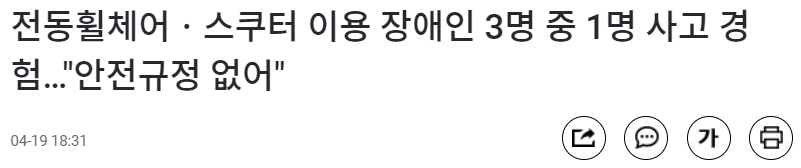
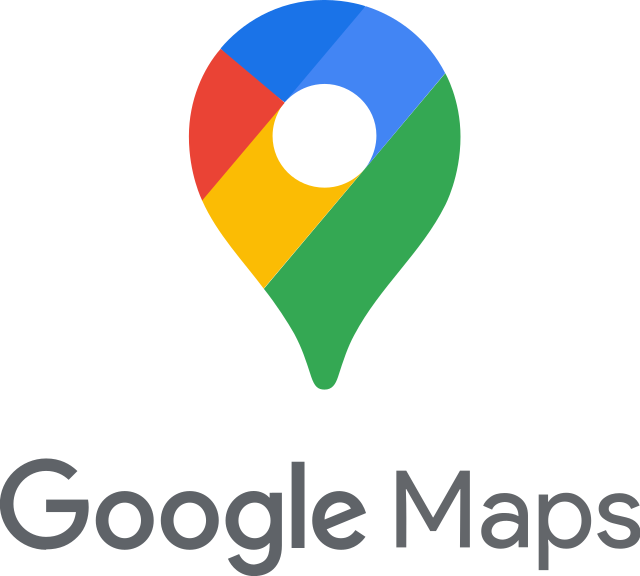

# Rolling Together

<aside>
💡 이동 보조기기(수동/전동 휠체어, 전동 스쿠터) 이용자의 편리한 일상생활(생활편의)을 위한 정보 공유 커뮤니티

</aside>

# 목차

1. 서론
    - 배경 및 필요성
    - 목적
    - 연구 방법
2. 문제점
    - 대중교통 이용의 어려움
    - 장애인 편의 시설 부족
    - 일상생활 속 위험 요소 부족
3. 해결 및 구현 방안
    - 사용한 기술
    - 일상 생활 속의 위험 장소를 공유
    - 장소에 대한 이용 리뷰를 공유
    - 대중교통 정보 공유
        - 버스
        - 지하철
    - 장애인 편의 시설 위치 정보 제공
    - 이동 보조기기 사용 가이드 제공
4. 기대 효과
    - 시장조사 및 Rolling Together만의 차별점
    - 기대 효과
        - 개인
        - 사회
5. 프로젝트 실행 방법

# 1. 개요

---

휠체어 사용자를 비롯해 전동휠체어, 전동 스쿠터와 같이 이동보조기기를 사용하는 분들은 간단히 집밖으로 산책을 나가는 것 조차 쉽지 않습니다. 한 번의 외출에도 지나갈 수 없는 공사시설, 높은 턱, 장애인 화장실의 유무 등 고려해야할 것이 많죠.

누군가에게는 사소한 일상생활이 그들에게는 걸림돌이 되면서 외출은 마음편히 나갈 수 있는 것이 아닌, 계획을 가지고 나가야하는 힘든 여정이 되었습니다.

그분들에게 더 이상 외출을 미지의 모험이 아닌, 소소한 일상으로 만들어 드리기 위해

바퀴가 달린 이동보조기기를 이용하시는 분들이 함께 정보를 공유하며 이동하자는 의미를 담은

**Rolling Together 서비스**를 생각하게 되었습니다.

# 2. 제안 배경

---

### 이동 보조기기 이용자 이동 중 사고 관련 뉴스

](Untitled.png)

출처 -[https://www.yna.co.kr/view/MYH20160419017700038](https://www.yna.co.kr/view/MYH20160419017700038)

](Untitled%201.png)

출처 - [https://news.kbs.co.kr/news/view.do?ncd=3148727](https://news.kbs.co.kr/news/view.do?ncd=3148727)

](Untitled.jpeg)

출처 - [https://youtu.be/l9bNtlmjaVs](https://youtu.be/l9bNtlmjaVs)

](Untitled%202.png)

출처 - [https://www.youtube.com/watch?v=BHXUSOm3o28](https://www.youtube.com/watch?v=BHXUSOm3o28)

### 장애인 전동 휠체어 교통 안전에 관한 연구 자료(조선대학교, 2022)

“교통사고 장소는 인도와 횡단보도 안전사고가 48건(28.2%), 도로(차도)가 75건(44.1%), 병원이나 복지 시설 또는 센터, 마트, 쇼핑몰 등의 시설이 47건(27.6%)로 나타났다.”

“사고 장소의 도로 상태는 경사 면이 70건(41.2%)으로 도로 또는 진입로 등의 경사 면에서 사고가 많이 발생되었으며, 미끄럽고 젖은 지형에서 36건(21.2%), 울퉁불퉁한 고르지 못한 거친 지형이 32건(18.8%), 도로 턱과 지면의 높이가 다른 곳에서 27건(15.9%)으로 바닥이 고르지 못한 지형에서 주로 사고가 발생하였다.”

출처 - [https://www.earticle.net/Article/A413981](https://www.earticle.net/Article/A413981)

## 문제점

- **지인 인터뷰**

“저상 버스 이용 시 눈치가 보이고, 작동 여부를 알 수 없어서 거의 이용하지 않아요.”

“인도로 가는 도중 높은 턱 때문에 넘어져 다친 적이 있어요.”

“처음 가는 장소에 갈 때 알아봐야 할 것들이 많은데, 귀찮아서 잘 안 나가게 돼요.”

- ‘**한국 장애인 단체 총 연맹 394호 전동 보조기기 이동 안전 빨간불 자료’ 인터뷰**

“낮은 곳에서 올라 왔으면 끝까지 가서 낮은 곳이 있어야 하는데, 가다보면 낮은 곳이 없고 높은 곳이 있어요. 그러면 거기까지 갔다가 다시 되돌아오려니 너무나 힘듭니다.”

“약속 장소를 정할 때 한 시간은 부족해요. 그 장소에 계단은 없는지, 경사로와 엘리베이터는 있는지 확인하려면 길게는 일주일도 걸립니다. 비 장애인들에게는 간단한 일이 우리에게는 말도 안되게 어려워요.”

 교통약자는 인간으로서의 존엄과 가치 및 행복을 추구할 권리를 보장받기 위하여 교통약자가 아닌 사람들이 이용하는 모든 교통수단, 여객시설 및 도로를 차별 없이 안전하고 편리하게 이용하여 이동할 수 있는 권리를 가진다.

위는 대한민국 「교통약자 이동편의 증진법」 제3조입니다. 대한민국은 교통약자의 이동권을 법으로써 보장하고 있습니다. 하지만, 여러 사례들을 미루어 볼 때, **실제로 이들의 이동권이 제대로 보장되고 있다고 할 수 있을까요?**

당연한 권리를 제대로 누리지 못하고 있는 현상황에 대해 아래와 같은 3가지 문제를 제기합니다.

### 1. 이동성 제약

- 대중교통 사용 시 리프트 장착/정상 작동 여부를 알기 어렵습니다.

### 2. 안전 사고 발생

- 보행 중 높은 턱, 경사로, 장애물 등을 갑자기 마주하여 안전 사고가 발생합니다.

### 3. **장애인 편의 시설 정보 부족**

- 장애인 화장실, 전동보조기기 충전소에 관한 정보의 접근성이 떨어집니다.
- 가게 내 경사로와 문턱 유무를 자세히 알 수 없습니다.

> 해결 목표
> 

따라서 위의 문제점들을 해결하기 위해 저희는

## **“이동보조기기 사용자들의 일상생활 속 불편함 최소화”**

를 목표로 하고자 합니다.

목표를 구체화하기 위한 해결포인트는 다음과 같습니다.

💡 보행이 불안하지 않도록 해 이동권을 확대
💡 안전사고 예방
💡 이동 보조기기를 사용하는 교통약자와 관련한 정보 접근성을 개선

# Solution for UN SDGs 11

# 3. 해결 및 구현 방안

---

### 사용한 기술

- 백엔드: Firebase
- 앱 구현: Flutter
- 지도: Google Maps
- 지하철, 버스 정보: 대한민국 공공데이터포털 Open API
- 주소: 카카오 Local API

위와 같은 기술들을 사용하여 "Rolling Together" 서비스를 구현하였습니다.

- Firebase는 백엔드 서비스를 제공하는 플랫폼으로, 사용자 인증, 데이터 저장, 파일 저장 등 다양한 기능을 제공합니다. "Rolling Together"에서는 Firebase Realtime Database를 사용하여 사용자가 게시한 정보를 실시간으로 저장하고, Firebase Authentication을 사용하여 사용자 인증을 구현하였습니다.
- Flutter는 Google에서 개발한 모바일 앱 개발 프레임워크로, 하나의 코드로 iOS와 Android 모두를 지원합니다. "Rolling Together" 앱은 Flutter로 구현되었으며, Flutter의 다양한 위젯들을 이용하여 UI를 구성하였습니다.
- Google Maps는 지도 API로, 지도 데이터를 제공하고 지도를 표시하는 기능을 제공합니다. "Rolling Together"에서는 Google Maps API를 사용하여 지도를 표시하고, 사용자가 게시한 정보들을 지도 위에 마커로 표시하였습니다.
- 대한민국 공공데이터포털 Open API는 대한민국 공공 데이터를 제공하는 API로, "Rolling Together"에서는 버스와 지하철 정보를 제공하는 API를 사용하여 해당 정보들을 앱 내에서 제공하였습니다.
- 카카오 Local API는 주소 검색과 좌표 변환 등의 기능을 제공하는 API로, "Rolling Together"에서는 사용자가 검색한 주소를 기반으로 해당 장소의 좌표를 구하고 지도 상에 마커로 표시하는 기능을 구현하는 데 사용하였습니다.

- **일상 생활 속의 위험 장소를 공유**
1. 사용자가 높은 턱, 공사장, 경사로 등 일상생활 중 마주 칠 수 있는 위험장소의 위치를 등록하여 지도에 표시합니다.
    1. 등록을 할 때는 사진과 설명을 써서 위험장소에 대한 상세한 정보를 공유합니다.
2. GPS를 사용해 정확한 위치 주소를 공유합니다.
3. 필터링을 통하여 동일한 위험장소가 과도하게 중복 신고 되지 않도록 합니다.

- **장소에 대한 이용 리뷰를 공유**
1. 음식점, 카페, 문화시설 등 여러 장소의 시설물 정보(입구사진, 경사로, 문턱 등)를 사용자가 직접 제공할 수 있습니다.
2. 시설에 대한 자세한 설명은 게시글(사진, 글)을 통해 업데이트 될 수 있도록 합니다.
3. 댓글을 통해 커뮤니티를 활성화합니다.
4. 가게가 새로 생기거나 문을 닫는 경우, 리모델링을 하는 경우 등 장소 정보가 변경되었을 경우 사용자가 이슈를 업데이트 할 수 있도록 합니다.

- **대중교통 정보 공유**

[ 버스 ]

1. 저상버스의 노선번호와 일련번호를 제공합니다.
2. 사용자는 노선번호, 일련번호를 선택하여 저상버스의 휠체어 리프트 정상작동 여부를 게시글을 통해 공유할 수 있습니다.

[ 지하철 ]

1. 지하철 승강장으로 내려가고 지상으로 올라오는 엘리베이터, 휠체어 리프트에 대한 정보를 제공합니다.
2. 사용자는 역을 선택하여 엘리베이터, 휠체어 리프트의 정상작동 여부와 또다른 추가 정보를 게시글을 통해 공유할 수 있습니다.

- **장애인 편의 시설 위치 정보 제공**
1. 지도상의 마커를 통해 장애인 편의시설 (전동 휠체어 충전소, 장애인 화장실)의 기본적인 위치 정보를 제공합니다.
2. 사용자가 장애인 편의시설에 대한 리뷰도 남길 수 있도록 합니다.
3. 시설물의 종류 별로 마커의 색깔과 아이콘을 구별합니다. 사용자는 색상으로 분류된 마커를 통해 본인이 찾고 싶은 시설물의 정보를 한 눈에 구별할 수 있습니다.
- **이동 보조기기 사용 가이드 제공**
1. 휠체어, 전동휠체어, 전동 스쿠터 등 이동보조기기 사용에 대한 잘 정리된 설명서를 제공합니다.
2. 전동 휠체어 충전소나 장애인 화장실 이용 방법에 대한 설명서도 제공합니다.

# 4. 기대 효과

---

> 시장조사 및 Rolling Together만의 차별점
> 

기존에 존재하던 서비스들은 주로 사용자에게 정보를 일방적으로 제공하는 것에 초점이 맞춰져 있었기 때문에 **빠른 정보 업데이트가 되지 않았습니다. 다양한 공공시설 및 문화시설들에 대한 정보를 제공하는 것에도 분명한 한계**가 존재했습니다.

저희 Rolling Together은 다양한 항목들에 대한 커뮤니티 매핑을 이용해 **이러한 한계들을 극복**할 수 있을 것으로 예상합니다. 추가적으로, **이동 보조기기와 시설 사용에 대한 잘 정리된 설명서**를 제공하여 사용자들이 매끄럽게 일상을 이어나갈 수 있도록 도울 것입니다.

> 기대 효과
> 

**개인**

- **정보 탐색 시간 절약**
    
    약속에 나가기 위해 더 이상 많은 시간을 할애하지 않아도 됩니다. Rolling Together는 다양한 정보를 종합적으로 간편하게 열람이 가능합니다.
    
- **빠른 업데이트를 통한 불편함 감소**
    
    Rolling Together은 ‘Community-Mapping’ 어플입니다. 사용자들이 자유롭게 자발적으로 실시간 정보 업데이트가 가능합니다. 따라서 더 이상 최신 정보를 찾기 위해 큰 노력을 들일 필요가 없습니다.
    
- **일상생활의 회복**
    
    후천적으로 장애를 입은 경우, 달라진 일상생활에 대해 깊은 우울감과 좌절을 겪을 수 있습니다. 하지만, Rolling Together이 빠른 일상생활로의 회복을 돕습니다.
    
- **외출 부담 감소**
    
    낯선 장소에 대한 부담은 외출로 이어지기 힘듭니다. 사용자에게 편의시설에 대한 정보들을 제공하여 낯선 장소에 대한 부담을 최소화하여 언제든지 부담없이 외출할 수 있도록 합니다.
    
- **안전 사고 예방**
    
    주행 중 갑작스런 위험에 빠질 수 있는 걱정을 덜으셔도 됩니다. 공유된 정보를 통해 미리 안전을 지킬 수 있습니다.
    

**사회**

- **배리어-프리 실천**
    
    배리어-프리 실천을 통해 소수 또한 존중받는 사회에 한걸음 더 가까워지게 됩니다.
    
- **혁신적 포용국가로의 성장**
    
    교통약자가 차별과 배제를 받지 않고 동등하게 살아갈 수 있도록 도움을 주며, 혁신적 포용사회/국가로 발전할 수 있습니다.
    
- **UN의 지속가능발전(SDGs)**
    
    UN의 지속가능발전목표의 ‘단 한 사람도 소외되지 않는 것’이라는 슬로건에 맞게, 그 누구도 소외되지 않도록 할 것입니다.
    
- **장기 성장에 도움**
    
    OECD는 불평등이 장기 성장에 저해되므로 포용적 성장을 해야한다고 발표한 바가 있습니다. 따라서 이동보조기기 사용자들의 불평등 해결이 장기 성장에 도움이 될 수 있습니다.
    
- **지역 경제 활성화**
    
    외출 증가로 소비층이 확대 될 것으로 기대되며, 이로 인해 지역 경제가 활성화 될 것으로 예상됩니다.
    
- **How to run**

Here are the steps to download the Flutter app from [https://github.com/Rolling-Together/RollingTogether.git](https://github.com/Rolling-Together/RollingTogether.git) and run it on Android Studio:

1. Install Flutter and Android Studio.
2. Go to [https://github.com/Rolling-Together/RollingTogether.git](https://github.com/Rolling-Together/RollingTogether.git) and download the app.
3. Open Android Studio and select File -> Open from the menu, then open the downloaded app folder.
4. Once Android Studio loads the project, select Run -> Run from the top menu.
5. Select an emulator or connect a mobile device to run the app.
