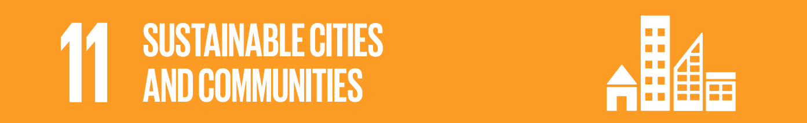

# Rolling Together

<aside>
💡 An information sharing community for convenient daily life (living convenience) for users of mobility aids (manual/electric wheelchairs, electric scooters)

</aside>

# index

1. Introduction
     - Background and Necessity
     - purpose
     - Research methods
2. Issues
     - Difficulties in using public transportation
     - Lack of facilities for the disabled
     - Lack of risk factors in daily life
3. Solution and implementation plan
     - Skills used
     - Sharing dangerous places in daily life
     - Share user reviews about places
     - Share public transportation information
         - bus
         - subway
     - Provision of location information for facilities for the disabled
     - Guide to using mobility aids provided
4. Expected effect
     - Market research and the uniqueness of Rolling Together
     - Benefit
         - individual
         - society
5. Project Execution Method

# 1. Overview

---

**Rolling Together** is a service that aims to help wheelchair users and individuals who use mobility aids such as electric wheelchairs and electric scooters to navigate their daily lives with ease. For these individuals, even a simple walk outside the house can be a daunting task as they need to consider various factors such as construction facilities, high curbs, and the availability of disabled toilets.

We understand that these trivial daily life obstacles can often become a hindrance for them, making going out a difficult journey that requires careful planning rather than a comfortable way to enjoy the outdoors. Rolling Together was created with the purpose of changing this reality and providing a platform for individuals who use wheeled mobility aids to share information and move together. Through this service, we aim to make going out a small daily life and not an unknown adventure.

# 2. Proposal background

---

### Accident news while moving users of mobility aids

](news1.png)

Source -[https://www.yna.co.kr/view/MYH20160419017700038](https://www.yna.co.kr/view/MYH20160419017700038)

 ](Untitled%201.png)

Source - [https://news.kbs.co.kr/news/view.do?ncd=3148727](https://news.kbs.co.kr/news/view.do?ncd=3148727)

](Untitled.jpeg)

Source - [https://youtu.be/l9bNtlmjaVs](https://youtu.be/l9bNtlmjaVs)

](Untitled%202.png)

Source - [https://www.youtube.com/watch?v=BHXUSOm3o28](https://www.youtube.com/watch?v=BHXUSOm3o28)

### Research data on traffic safety for electric wheelchairs for the disabled (Chosun University, 2022)

“As for traffic accidents, 48 cases (28.2%) of sidewalks and crosswalk safety accidents, 75 cases (44.1%) of roads (driveways), 47 cases (27.6%) of facilities such as hospitals, welfare facilities, centers, marts, shopping malls, etc. ) appeared.”

“As for road conditions at the site of the accident, 70 cases (41.2%) were on slopes, with many accidents occurring on slopes such as roads or driveways, 36 cases (21.2%) on slippery and wet terrain, and 32 cases on uneven and rough terrain. (18.8%), and 27 cases (15.9%) where the height of the road bump and the ground were different, mainly on uneven terrain.”

Source - [https://www.earticle.net/Article/A413981](https://www.earticle.net/Article/A413981)

## problem

- **Interview with acquaintances**

“I notice when using a low-floor bus, and I rarely use it because I don’t know if it works.”

“On the way to India, I fell and got hurt because of my high chin.”

“There are a lot of things I need to know when I go to a place for the first time, but I don’t go out because it’s annoying.”

- Interview with ‘**Korean Federation of Disabled People’s Organizations No. 394 Safety Red Light Data for Moving Assistive Devices**

“If you came up from a low place, you have to go all the way to a low place, but as you go, there is no low place and there is a high place. Then it is very difficult to get there and then come back.”

“An hour is not enough when deciding where to meet. It can take up to a week to make sure there are no stairs, ramps and elevators in the place. Simple things for non-disabled people are ridiculously difficult for us.”

  Persons with disabilities in transportation have the right to move by safely and conveniently using all means of transportation, passenger facilities and roads used by people other than persons with disabilities in transportation without discrimination in order to be guaranteed their right to pursue their dignity, value and happiness as human beings.

The above is Article 3 of the Act on Promotion of Mobility Convenience for the Transportation Vulnerable Persons of the Republic of Korea. The Republic of Korea guarantees the right to move for the transportation vulnerable by law. However, considering many cases, **Can we say that their right to move is actually properly guaranteed?**

We raise the following three issues regarding the current situation in which we are not properly enjoying our natural rights.

### 1. Mobility constraints

- When using public transportation, it is difficult to know whether the lift is installed/operated normally.

### 2. Occurrence of a safety accident

- A safety accident occurs when a person suddenly encounters a high bump, ramp, obstacle, etc. while walking.

### 3. **Lack of accessibility information**

- Accessibility to information about disabled toilets and charging stations for power assist devices is poor.
- It is not possible to know in detail whether there are ramps and thresholds in the store.

> Resolution Goal
>

Therefore, to solve the above problems, we

## **“Minimizing inconveniences in daily life for mobility aid users”**

want to aim for.

The resolution points to materialize the goal are as follows.

💡 Expand the right to move by making walking less unstable
💡 Prevention of safety accidents
💡 Improving the accessibility of information related to transportation vulnerable people using mobility aids

# Solution for UN SDGs 11

# 3. Solution and implementation plan

---

### Skills used

|   Firebase   |    Flutter    |  Google Maps  |
|:------------:|:-------------:|:-------------:|
|   |  |  |

- Backend: Firebase
- App Implementation: Flutter
- Map: Google Maps
- Subway, bus information: Republic of Korea public data portal Open API
- Address: Kakao Local API

We implemented the "Rolling Together" service using the above technologies.

- Firebase is a platform that provides backend services, providing various functions such as user authentication, data storage, and file storage. In "Rolling Together", the Firebase Realtime Database is used to store information posted by users in real time, and user authentication is implemented using Firebase Authentication.
- Flutter is a mobile app development framework developed by Google that supports both iOS and Android with one code. The "Rolling Together" app was implemented with Flutter, and the UI was composed using various widgets of Flutter.
- Google Maps is a map API, providing the ability to provide map data and display maps. In "Rolling Together", the Google Maps API was used to display the map, and information posted by users was displayed as markers on the map.
- Korea public data portal Open API is an API that provides public data in Korea, and "Rolling Together" uses an API that provides bus and subway information to provide the information within the app.
- Kakao Local API is an API that provides functions such as address search and coordinate conversion. In "Rolling Together", it is used to implement a function that obtains the coordinates of the place based on the address searched by the user and displays it as a marker on the map. Used.

- **Share dangerous places in everyday life**
1. Registers the locations of dangerous places that users may encounter in daily life, such as high ridges, construction sites, and ramps, and displays them on the map.
     1. When registering, share detailed information about the dangerous place by using pictures and descriptions.
2. Share your exact location address using GPS.
3. Through filtering, the same dangerous place is not reported excessively and repeatedly.

- **Share user reviews of places**
1. Users can directly provide facility information (entrance photos, ramps, thresholds, etc.) of various places such as restaurants, cafes, and cultural facilities.
2. Detailed descriptions of facilities can be updated through posts (photos, texts).
3. Enliven the community through comments.
4. Allow users to update issues when the location information changes, such as when a store is newly opened, closed, or remodeled.

- **Share public transportation information**

### bus

1. Provide the route number and serial number of the low-floor bus.
2. Users can select the route number and serial number to share whether or not the wheelchair lift of the low-floor bus is operating normally through a post.

### subway

1. Provides information on elevators and wheelchair lifts that go down to the subway platform and go up to the ground.
2. Users can select a station to share information about normal operation of elevators and wheelchair lifts and other additional information through posts.

- **Provide location information for facilities for the disabled**
1. Map markers provide basic location information for facilities for the disabled (electric wheelchair charging stations, toilets for the disabled).
2. Allow users to also leave reviews for accessible facilities.
3. Distinguish marker colors and icons for each type of facility. Users can distinguish the facility information they want to find at a glance through color-coded markers.
- **Guidance on using mobility aids provided**
1. We provide well-organized instructions for the use of mobility aids such as wheelchairs, electric wheelchairs, and electric scooters.
2. Instructions on how to use the electric wheelchair charging station or accessible restroom are also provided.

# 4. Expected effect

---

> Market research and the difference between Rolling Together
>

Existing services mainly focused on providing information to users unilaterally, which caused fast information updates to be limited. We expect to overcome these limitations by using community mapping for various items. In addition, we will provide well-organized instructions for using mobility aids and facilities to help users go about their daily lives smoothly.

> Expected effect
>

**individual**

- **Save time searching for information**
    
     You no longer have to spend a lot of time getting to your appointments. Rolling Together provides comprehensive and easy access to a variety of information.
    
- **Reduction of inconvenience through quick update**
    
     Rolling Together is a ‘Community-Mapping’ application. Users can freely and voluntarily update real-time information. So you no longer have to go to great lengths to find the latest information.
    
- **Recovery of daily life**
    
     If you have acquired a disability, you may experience deep depression and frustration about the changed daily life. However, Rolling Together helps to quickly return to daily life.
    
- **Reduced outing burden**
    
     The burden of unfamiliar places is hard to lead to going out. By providing information on convenience facilities to users, it minimizes the burden of unfamiliar places so that they can go out at any time without any burden.
    
- **Safety Accident Prevention**
    
     You don't have to worry about being in sudden danger while driving. Shared information helps you stay safe in advance.
    

**society**

- **Barrier-Free Practice**
    
     Barrier-free practices bring us one step closer to a society where minorities are respected.
    
- **Growth to an innovative and inclusive country**
    
     We help the transportation vulnerable to live equally without discrimination and exclusion, and develop into an innovative inclusive society/nation.
    
- **UN Sustainable Development (SDGs)**
    
     In line with the slogan of the UN Sustainable Development Goals, “no one is left behind,” we will ensure that no one is left behind.
    
- **Helps long-term growth**
    
     The OECD has announced that inclusive growth is necessary because inequality hinders long-term growth. Therefore, addressing inequalities among mobility aid users can help long-term growth.
    
- **Revitalization of the local economy**
    
     The increase in outing is expected to expand the consumer base, which is expected to stimulate the local economy.
### How to run

Here are the steps to download the Flutter app from [https://github.com/Rolling-Together/RollingTogether.git](https://github.com/Rolling-Together/RollingTogether.git) and run it on Android Studio:

1. Install Flutter and Android Studio.
2. Go to [https://github.com/Rolling-Together/RollingTogether.git](https://github.com/Rolling-Together/RollingTogether.git) and download the app.
3. Open Android Studio and select File -> Open from the menu, then open the downloaded app folder.
4. Once Android Studio loads the project, select Run -> Run from the top menu.
5. Select an emulator or connect a mobile device to run the app.
